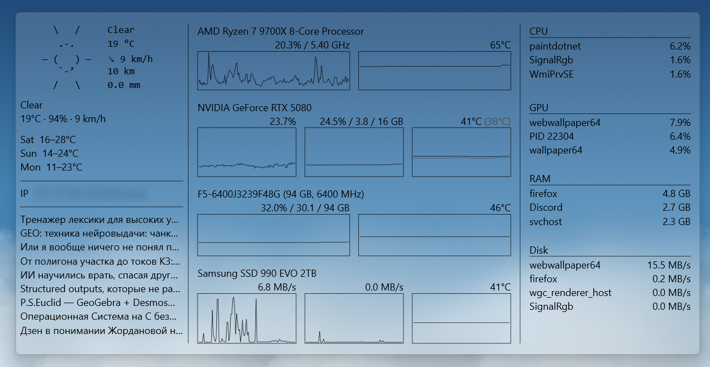

# BlurBox

[](https://github.com/semenovi/aero-widget/releases/latest)
[](https://github.com/semenovi/aero-widget/releases/latest)
[](LICENSE)
[](BlurBox.vcxproj)

A lightweight Windows desktop widget with an Acrylic/Aero blur background. Displays real-time system stats, weather, and a news feed — all rendered with Direct2D on a frosted-glass overlay that sits on your desktop.



---

## Features

- **System monitoring**
  - CPU — total load with actual frequency (GHz), per-logical-core, per-physical-core, or load+temperature view (click to cycle)
  - GPU — core load, VRAM usage, temperature, or combined view (click to cycle); NVML support for NVIDIA RTX GPUs; GPU hot-spot temperature (e.g. AMD 5000-series) shown alongside edge temperature when available via HWiNFO64
  - RAM — used / total
  - Disk I/O — aggregate or per-disk view (click to cycle)
- **Per-process top lists** — CPU, GPU, RAM, and Disk top consumers; click a tile to toggle between percent and absolute values; hover freezes the list so you can read it; right-click an entry to kill the process
- **Weather panel** — current conditions and 3-day forecast fetched from [wttr.in](https://wttr.in), with ASCII-art icons; refreshed automatically every 10 minutes; click the panel to force an immediate refresh
- **RSS feed** — configurable RSS source (default: Habr), refreshed on a configurable interval; click a headline to open it in the browser
- **Acrylic / Aero blur** — uses the undocumented `SetWindowCompositionAttribute` API with DWM fallback, so it works across Windows 10 and 11; rounded corners via DWM
- **Resizable window** — drag any edge or corner to resize, in addition to dragging the internal panel dividers
- **Configurable column layout** — number of columns and panel assignment per column are fully configurable in `config.json`; vertical and horizontal dividers appear automatically and are draggable; divider visibility can be toggled off per axis/column
- **Persistent layout** — window position, size, and divider positions are saved to `config.json` next to the executable
- **Configurable font scale** — set `font_scale` in `config.json` to scale all text
- **CPU temperature sources** — automatically tries HWiNFO64 shared memory, then OpenHardwareMonitor WMI, then LibreHardwareMonitor WMI, then MSAcpi thermal zone, then PDH; no manual configuration needed

## Requirements

- Windows 10 or Windows 11 (64-bit recommended)
- NVIDIA GPU with drivers that ship `nvml.dll` for GPU temperature (optional; falls back to PDH)
- [HWiNFO64](https://www.hwinfo.com/) with **Shared Memory Support** enabled for best CPU temperature coverage on AMD Ryzen, and for GPU hot-spot temperature (e.g. AMD 5000-series GPUs) — NVML has no hot-spot sensor (optional; other sources are tried automatically)

## Building

1. Open `BlurBox.sln` in **Visual Studio 2022** (v143 toolset).
2. Select the **Release | x64** configuration.
3. Build — no external dependencies beyond the Windows SDK.

The binary is written to `bin\x64\Release\BlurBox.exe`.

> **Debug log:** on every run BlurBox writes weather fetch diagnostics to `weather_debug.log` next to the executable. You can safely delete this file.

## Configuration

On first launch a `config.json` file is created next to the executable. You can edit it manually:

```jsonc
{
    "location": "Moscow",
    "monitor_left": 0,
    "monitor_top": 0,
    "win_x": 100,
    "win_y": 100,
    "win_w": 1113,
    "win_h": 614,
    "cpu_mode": 0,
    "gpu_mode": 0,
    "ram_mode": 0,
    "disk_mode": 0,
    "disk_sub_mode": 0,
    "font_scale": 1.5,
    "autostart": false,
    "debug": false,
    "show_vert_dividers": true,
    "rss_feed_url": "https://habr.com/ru/rss/all/all/",
    "proc_abs_cpu": 0,
    "proc_abs_gpu": 0,
    "proc_abs_ram": 0,
    "proc_abs_disk": 0,
    "col_count": 3,
    "col_1": "weather|ip|rss",
    "col_1_show_ydiv": true,
    "col_2": "cpu_chart|gpu_chart|ram_chart|disk_chart",
    "col_2_show_ydiv": true,
    "col_3": "cpu_proc|gpu_proc|ram_proc|disk_proc",
    "col_3_show_ydiv": true
}
```

### General keys

| Key | Description |
|-----|-------------|
| `location` | Weather location string passed to wttr.in (e.g. `"Moscow"`); empty = auto-detect |
| `monitor_left`, `monitor_top` | Monitor origin used to restore position on multi-monitor setups (auto-saved) |
| `win_x`, `win_y` | Window position relative to the monitor it was last on (auto-saved) |
| `win_w`, `win_h` | Window size in pixels (auto-saved) |
| `cpu_mode` | CPU display mode: `0` total, `1` logical cores, `2` physical cores, `3` load+temp (auto-saved) |
| `gpu_mode` | GPU display mode: `0` core load, `1` VRAM, `2` temperature, `3` core+VRAM, `4` core+VRAM+temp (auto-saved) |
| `ram_mode` | RAM display mode: `0` load, `1` load+temp (auto-saved) |
| `disk_mode` | Disk index: `0` aggregate, `1`–`N` individual disk (auto-saved) |
| `disk_sub_mode` | Disk sub-mode: `0` single value, `1` read+write, `2` read+write+temp (auto-saved) |
| `font_scale` | Global text scale factor (default `1.5`) |
| `autostart` | Launch with Windows (auto-saved) |
| `debug` | Enable verbose debug logging to `weather_debug.log` (default `false`) |
| `show_vert_dividers` | Show/hide the draggable vertical dividers between columns (default `true`) |
| `rss_feed_url` | RSS feed URL (default: Habr all articles); change to any valid RSS 2.0 feed |
| `proc_abs_cpu/gpu/ram/disk` | `1` = show absolute values in process lists, `0` = percent (auto-saved) |

### Layout keys

| Key | Description |
|-----|-------------|
| `col_count` | Number of columns (`1`–`8`) |
| `col_N` | Pipe-separated list of panels for column N (e.g. `"weather\|ip\|rss"`) |
| `col_N_show_ydiv` | Show/hide the horizontal dividers inside column N (default `true`) |
| `col_div_K` | X position of the vertical divider between column K and K+1 (auto-saved on drag-end) |
| `col_N_ydiv_R` | Y position of the R-th horizontal divider inside column N (auto-saved on drag-end) |

Vertical dividers (`col_div_K`) and horizontal dividers (`col_N_ydiv_R`) are optional — if omitted, panels are spaced equally and dividers can be dragged to adjust. Set `show_vert_dividers` or `col_N_show_ydiv` to `false` to hide dividers along that axis without changing panel spacing.

#### Available panel types

| Panel | Description |
|-------|-------------|
| `weather` | Weather forecast panel |
| `ip` | External IP address and country |
| `rss` | RSS feed headlines |
| `cpu_chart` | CPU usage chart |
| `gpu_chart` | GPU usage chart |
| `ram_chart` | RAM usage chart |
| `disk_chart` | Disk I/O chart |
| `cpu_proc` | Top CPU processes list |
| `gpu_proc` | Top GPU processes list |
| `ram_proc` | Top RAM processes list |
| `disk_proc` | Top Disk processes list |
| `none` | Empty spacer |

#### Example: 2-column layout

```jsonc
{
    "col_count": 2,
    "col_1": "weather|ip|rss",
    "col_2": "cpu_chart|gpu_chart|ram_chart|disk_chart|cpu_proc|gpu_proc|ram_proc|disk_proc"
}
```

## Usage tips

- **Click** a chart to cycle through its display modes.
- **Click** a process list tile to toggle between percent and absolute value display.
- **Click** the weather panel to force an immediate weather refresh.
- **Right-click** a process entry to kill that process.
- **Right-click** anywhere else on the widget to close it (same as Escape).
- **Drag** vertical or horizontal dividers to resize panels; positions are saved automatically.
- **Drag** any edge or corner of the window to resize it.
- **Escape** closes the widget.
- The widget lives in the **system tray** — right-click the tray icon to toggle autostart or exit.
- Hovering over a process list tile **freezes** its updates so the list stays readable.

## License

Distributed under the terms of the [LICENSE](LICENSE) file included in this repository.
